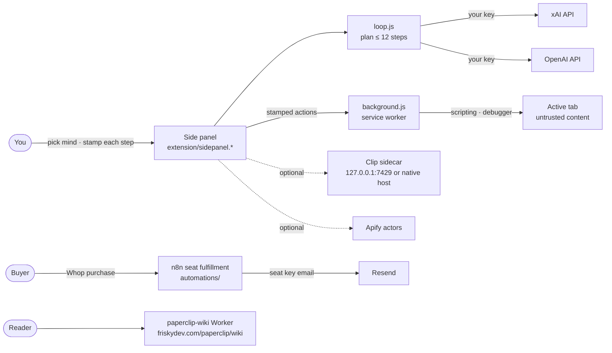

<p align="center">
  
</p>

<h1 align="center">FR!sky Paperclip for Chrome</h1>

<p align="center"><b>The agent desk as a side panel. Codex, Grok, Fenrir, Bruma, codePup, Clip.</b></p>

<p align="center">
  
  
  
</p>

Paperclip is a browser side-panel agent desk. You pick the mind, Grok (xAI API) or OpenAI plans up to 12 steps, and **Clip** performs clicks only after you stamp each step. You can halt at any time, and page content is treated as untrusted. The extension runs locally with your own API key and can hand work to a local Clip sidecar. This repo also holds the Safari port, native macOS and Windows desk apps, the install/landing site, the Paperclip field wiki Worker and the Whop seat-key automation. It is for people who want a supervised, local-first browser agent, and for the team shipping it to the stores. Not Claude-in-Chrome. Not a grok.com bookmark.

## Architecture



## Stack

- Chrome extension (Manifest V3, Chrome 116+): side panel, service worker, content scripting, native messaging
- Safari web-extension port (`safari/`), native macOS menu-bar desk (`macos/`, Swift), Windows desk (`windows/`, WinUI 3 + WebView2)
- Field wiki: React + react-markdown, built statically and served by a Cloudflare Worker (`wiki/`)
- Landing/install site and privacy policy on GitHub Pages (`docs/`)
- n8n / Make workflows for Whop → seat-key fulfillment (`automations/`)

## Project structure

```text
extension/     # Chrome MV3 extension: side panel, loop, background worker, options, icons
safari/        # Safari port of the extension
macos/         # native macOS desk app + DMG packaging
windows/       # native Windows desk app (WinUI 3), winget manifest
wiki/          # Paperclip field wiki (React build + Cloudflare Worker)
docs/          # GitHub Pages install site + privacy page
automations/   # Whop / Make seat-fulfillment workflows
store/         # store listings, screenshots, submission runbooks
scripts/       # build-store-zip.sh
tests/         # Windows test plan
```

## Local development

```bash
# Load the extension (no build step)
# Chrome → Extensions → Developer mode → Load unpacked → extension/

# Build the store zip (dist/frisky-paperclip-<version>.zip)
scripts/build-store-zip.sh

# Field wiki: build and test
cd wiki && npm install && npm run build && npm test

# macOS dev build, no Xcode needed (macos/dist/FR!sky Paperclip.app)
macos/build-app.sh
```

In **Options**, paste an xAI key. It stays on your machine. Then run the loop from the panel.

## Environment variables

The extension needs no environment variables. The key is entered in Options and kept in local extension storage. Seat fulfillment (`automations/.env.example`) uses these names:

- `WHOP_WEBHOOK_SECRET`
- `RESEND_API_KEY`
- `RESEND_FROM`
- `SEAT_PREFIX`

## Deploy

- **Extension:** packaged with `scripts/build-store-zip.sh` for the Chrome Web Store (link coming after review) and Edge (`store/edge-submission.md`).
- **Safari:** port staged in `safari/` (toolbar-popup build, 0.4.0). The container host app is pending; runbook in `store/safari-submission.md`.
- **macOS:** native menu-bar desk (⌥⌘P, floating panel, bundled web desk), in development for the Mac App Store. Runbook in `macos/APPSTORE.md`, listing copy in `store/appstore-listing.md`, notarization notes in `NOTARIZATION.md`.
- **Windows:** native desk app scaffolded in `windows/` (WinUI 3 + WebView2, 0.4.0), shipped as MSIX through the Microsoft Store. Runbook in `store/msstore-submission.md`.
- **Wiki:** `wiki/` deploys with Wrangler as the `paperclip-wiki` Worker on `friskydev.com/paperclip/wiki*`.
- **Site:** `docs/` is served by GitHub Pages at https://friskydevelopments.github.io/paperclip-chrome/ (privacy policy: `/privacy.html`).

## Pricing

$29 → $19 on Whop. The $49 kit already includes this room. See https://friskydevelopments.github.io/paperclip-chrome/.

## Clip sidecar

Clip can run as an HTTP service on this computer (`127.0.0.1:7429`) or as the native messaging host `com.friskydev.paperclip`. The sidecar is not part of this repository.
